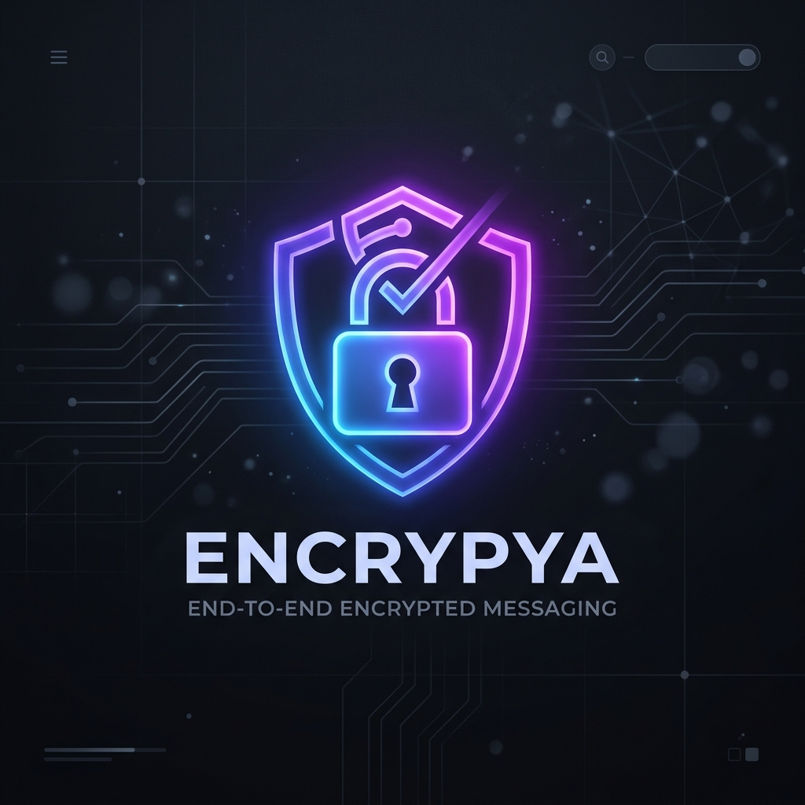

<p align="center">
  
</p>

<h1 align="center">E2EE Secure Chat</h1>

<p align="center">
  <strong>A 100% ephemeral, peer-to-peer, End-to-End Encrypted messaging client.</strong>
  <br>
  No storage. No logs. No traces.
</p>

<p align="center">
  
  
  
</p>

<hr>

## 🔒 True Privacy
E2EE Secure Chat is designed from the ground up for absolute privacy. It utilizes an ultra-lightweight WebSocket relay server that acts strictly as a router. The server does not possess the cryptographic keys required to read messages, nor does it log or store them on disk. 

When you disconnect, the chat history ceases to exist.

## ✨ Features
* **Zero-Knowledge Architecture:** Cryptographic keys are generated locally on your machine using Elliptic-Curve Diffie-Hellman (`prime256v1`). The server only sees ciphertext.
* **AES-256-GCM Encryption:** Military-grade payload encryption with authenticated data to prevent tampering.
* **Ephemeral By Design:** Absolutely zero database storage. Messages are held in RAM for a fraction of a millisecond while routing.
* **Desktop Notifications:** Receive native Windows alerts when a secure message arrives while the app is in the background.
* **One-Click Invites:** Automatically generate encrypted email invitations to securely onboard your contacts.

## 🚀 Quick Start
### 1. Download
Download the latest pre-compiled application from the **[Releases Tab](https://github.com/adaryusrgillum/e2ee-secure-chat/releases/tag/v1.0.0)**. 
Unzip the downloaded folder and double click `E2EE Secure Chat.exe` to launch the client.

### 2. Connect
Enter your Username and the Server URL (e.g., your ngrok URL or Render.com hosted server). Click **Connect & Generate Keys**. The app will locally generate your cryptographic identity and securely handshake with the relay.

### 3. Chat
Type a friend's username in the chat bar and start communicating securely.

## 🛠️ Development Setup
If you want to run the application from source:

```bash
# Clone the repository
git clone https://github.com/adaryusrgillum/e2ee-secure-chat.git

# Navigate into the project
cd e2ee-secure-chat

# Install dependencies
npm install

# Start the Electron App
npm start
```

## 🏗️ Technical Stack
* **Frontend:** HTML5, CSS3 (Glassmorphism UI), Vanilla JS
* **Backend Framework:** Electron.js, Node.js (`crypto`, `ws`)
* **Cryptography:** `prime256v1` (ECDH), `aes-256-gcm`

---

*Stay safe. Stay encrypted.*
